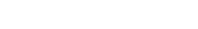
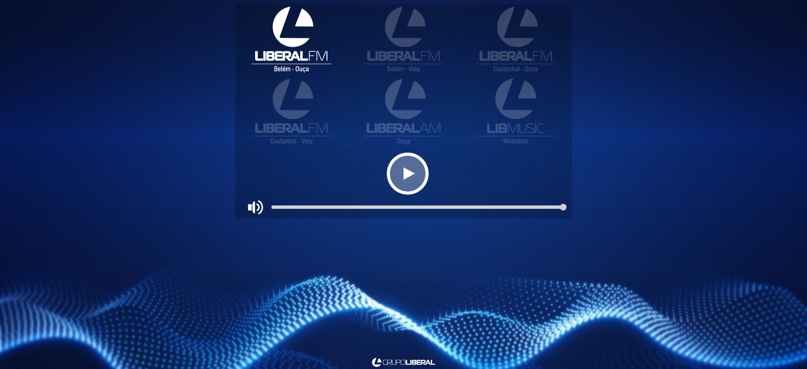
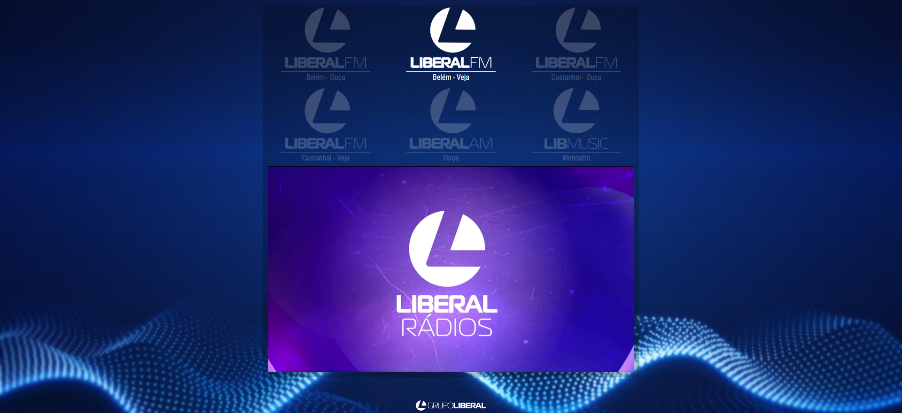
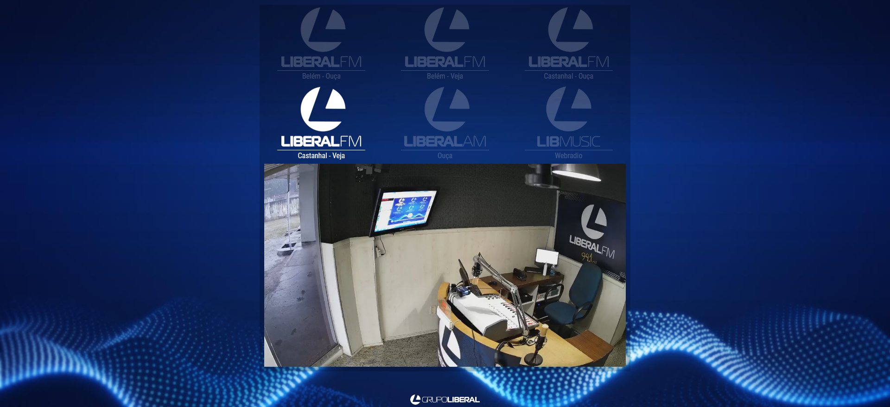
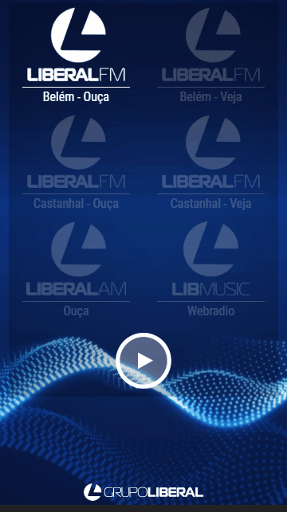

<h1 align="center">
 
  
 
 
Player da Radio Liberal
</h1>

É uma emissora de rádio brasileira sediada em Belém, capital do estado do Pará. Opera no dial FM, na frequência 90.5 MHz.
Projetos desenvolvido pela equipe de desenvolvimento com objetivo de fazer a cobertura do evento para web e mobile

  

    
   
   
  

## Tecnologia usada

Usado do modelo de framework WordPress, no servidor linux da libnet

- ⚛️ **Javascript** — colocar o player do wnoza
- ⚛️ **PHP** — PHP para servidor linux
- 💹 **JQuery** — para cadastro de imagens eplugins

## Modelos

1. Hospedado pelo LiBnet url:("http://fm.radioliberal.com.br/"/)
2. Todos os direito autoras pela jornal oliberal: 
3. Modelo apenas ilustratorio 

### Equipe de desenvolvimento

1. David orion (webdeveloper), Luis melo (webdesigner) e Flaberson Moraes (webdeveloper)

